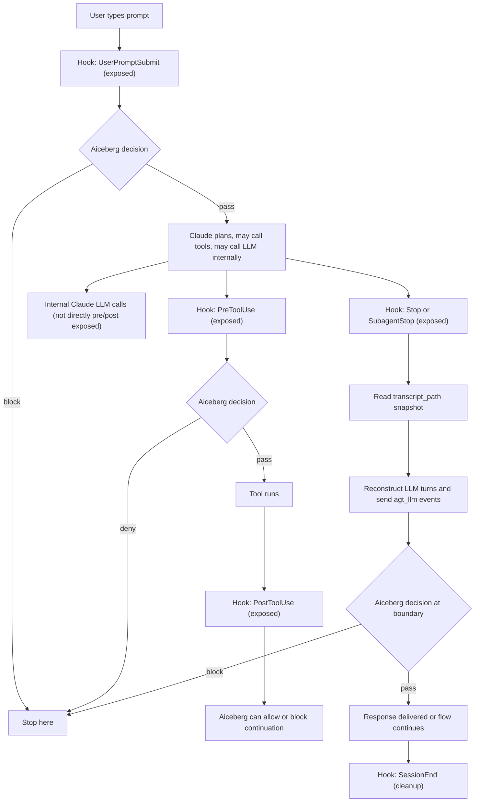
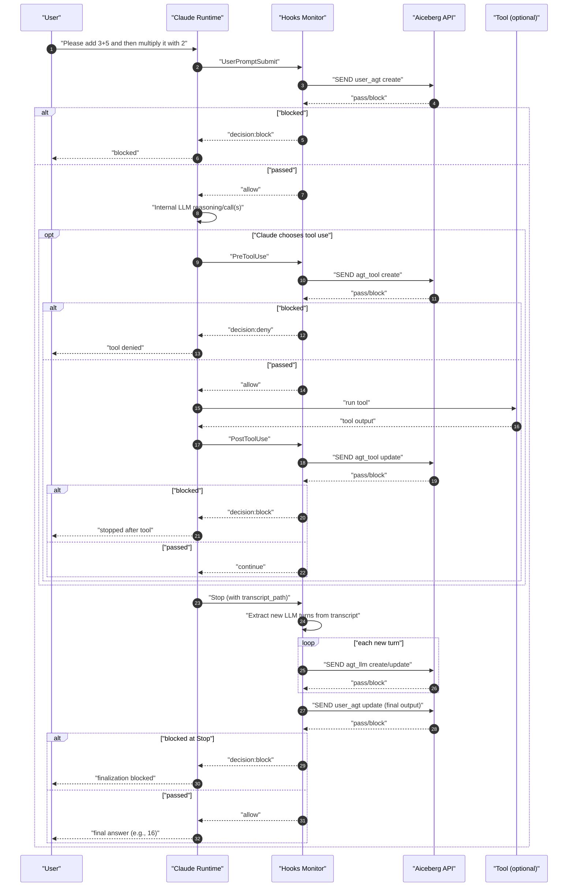

# Aiceberg Claude Hooks Guardrails (Hooks-Only)

This package uses Claude hooks as the only control plane for guardrails.
It sends hook event data to Aiceberg, receives a policy verdict, and either allows or blocks at block-capable hook boundaries.

## TL;DR

- You get strong observability across Claude lifecycle hooks.
- You can block only on block-capable hooks, not on every hook.
- Claude does not expose a direct pre/post internal LLM-call hook.
- LLM activity is reconstructed from `transcript_path` snapshots at `Stop` and `SubagentStop`.
- Reconstructed LLM turns are sent to Aiceberg as `agt_llm` events.

Detailed Strands parity notes are in:
- `/Users/sravanjosh/Documents/Aiceberg/Claude_agent_new/aiceberg-claude-hooks-guardrails/STRANDS_PARITY_AUDIT.md`

Detailed architecture HTML (with both lifecycle diagrams) is in:
- `/Users/sravanjosh/Documents/Aiceberg/Claude_agent_new/aiceberg-claude-hooks-guardrails/docs/HOOKS_ONLY_ARCHITECTURE_DETAILED.html`

## Git Secret Guard

This repo includes:
- `.pre-commit-config.yaml` with `gitleaks` (when network/package install is available)
- `scripts/git-hooks/pre-commit` offline scanner (works without downloads)

Enable repo hook path once:

```bash
chmod +x scripts/git-hooks/pre-commit
git config core.hooksPath scripts/git-hooks
```

Optional (when package/network is available):

```bash
python3 -m pip install pre-commit
pre-commit install
pre-commit run --all-files
```

## What Is In This Repo

- `hooks/hooks.json`: hook wiring for all supported events.
- `scripts/aiceberg_hooks_monitor.py`: stable wrapper entrypoint.
- `scripts/aiceberg_hooks/monitor.py`: hook dispatcher and enforcement flow.
- `scripts/aiceberg_hooks/api.py`: payload building + API send/logging.
- `scripts/aiceberg_hooks/storage.py`: config loading + SQLite + transcript parsing.
- `.claude-plugin/plugin.json`: plugin manifest.
- `.env` / `.env.example`: credentials and runtime flags.
- `config/config.json`: fallback defaults only.

## Hook Lifecycle, Visibility, and Control

| Stage | Hook | Exposed to monitor | Sent to Aiceberg as | Can block here? | What block means |
|---|---|---|---|---|---|
| User prompt arrives | `UserPromptSubmit` | prompt text + session | `user_agt` create | Yes | Prompt is rejected before main flow |
| Tool about to run | `PreToolUse` | tool name/input | `agt_tool` or `agt_mem` create | Yes | Tool call is denied before execution |
| Permission mediation | `PermissionRequest` | permission context | one-shot `agt_tool`/`agt_agt` | Yes | Permission denied |
| Tool finished | `PostToolUse` | tool output | matching event update | Yes | Tool already ran; future flow is blocked |
| Tool failed | `PostToolUseFailure` | error/interrupt | matching event update | No | Observe and close event |
| Finalization boundary | `Stop` | transcript path + session | close `user_agt` + emit `agt_llm` turns | Yes | Finalization/continuation blocked |
| Subagent final boundary | `SubagentStop` | subagent transcript path | emit `agt_llm` turns + subagent summary | Yes | Parent flow blocked at boundary |
| Session cleanup | `SessionEnd` | session closure | close remaining events | No | Cleanup only |

Observe-only hooks include `Setup`, `SessionStart`, `Notification`, `WorktreeCreate`, `WorktreeRemove`, and `PreCompact`.

## Diagram 1: End-to-End Hook Flow



## Diagram 2: Detailed Example (`3+5`, then `*2`)

User prompt: `Please add 3+5 and then multiply it with 2`



## How Transcript-Based `agt_llm` Works

Claude does not provide a direct `before_llm_call` / `after_llm_call` hook.
Instead, hooks like `Stop` and `SubagentStop` include `transcript_path`.

The monitor:

1. Reads transcript JSONL entries from `transcript_path`.
2. Groups contiguous assistant entries into assistant turns.
3. For each assistant turn, builds `input` from context since the previous assistant turn.
4. Builds `output` from that assistant turn content.
5. Sends `agt_llm` create/update to Aiceberg.

Example transcript snippet:

```json
{"type":"user","message":{"role":"user","content":"add 3+5 then *2"}}
{"type":"assistant","message":{"role":"assistant","content":[{"type":"text","text":"The result is 16."}]}}
```

This becomes:

- `agt_llm` input: `[user] add 3+5 then *2`
- `agt_llm` output: `[assistant] The result is 16.`

## Why You Do Not See Duplicate `agt_llm` Events

The monitor stores transcript cursor state in SQLite:

- table: `transcript_cursors`
- key: `session_id + transcript_path`
- value: last emitted turn index

So each hook run emits only new turns.
At `SessionEnd`, session cursors are cleared.

## Control Semantics (Important)

- `PreToolUse` block prevents that tool execution.
- `PostToolUse` block cannot undo the tool call, but can stop all downstream flow.
- `Stop`/`SubagentStop` block happens at finalization boundaries.
- Internal LLM generation has already occurred by the time `Stop` fires.

So transcript-based LLM guardrails give high observability plus boundary control, not pre-generation interruption.

## Quick Start

1. Set `.env` values:
   - `AICEBERG_API_KEY`
   - `AICEBERG_PROFILE_ID`
   - `AICEBERG_USE_CASE_ID`
   - optional `AICEBERG_MODE=enforce` or `observe`
2. Run the single query demo (real-send default):

```bash
cd /Users/sravanjosh/Documents/Aiceberg/Claude_agent_new
python3 /Users/sravanjosh/Documents/Aiceberg/Claude_agent_new/aiceberg-claude-hooks-guardrails/examples/single_query_demo.py --safe-only
```

3. Optional dry-run mode:

```bash
cd /Users/sravanjosh/Documents/Aiceberg/Claude_agent_new
python3 /Users/sravanjosh/Documents/Aiceberg/Claude_agent_new/aiceberg-claude-hooks-guardrails/examples/single_query_demo.py --dry-run --safe-only
```

## Useful Runtime Flags

- `AICEBERG_MODE=enforce|observe`
- `AICEBERG_DRY_RUN=true|false`
- `AICEBERG_PRINT_PAYLOADS=true|false`
- `AICEBERG_TINY_DEBUG_MODE=true|false`
- `AICEBERG_DEBUG_TRACE=true|false`
- `AICEBERG_DEBUG_TRACE_PATH=<file>`

## Local State

- SQLite DB default: `/tmp/aiceberg-claude-hooks/monitor.db`
- Local JSONL log default: `<plugin_root>/logs/events.jsonl`
